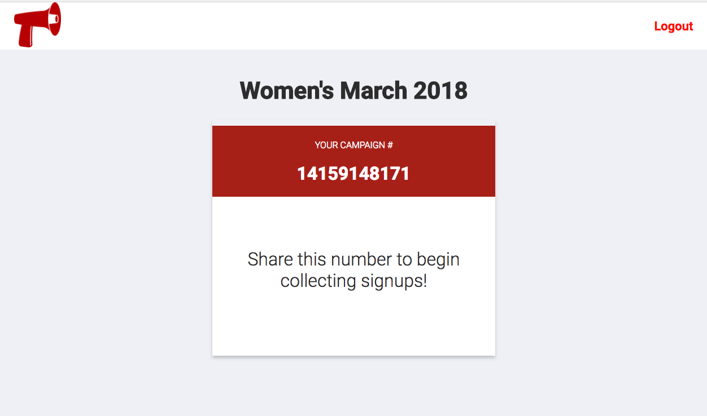

# Reached

A platform that uses the Twilio API and allows organizations to engage with a mass amount of followers via SMS messages.

[Link to Live Site](https://reached.herokuapp.com/)

## Setting up Development Environment

- Clone the repository
- Install your dependencies: `npm install`
- Create your database: `npm run db:create`
- Load the schema: `npm run db:reset`
- Create a `.env` file and copy and paste the content of the `.env.template` file and insert your own environment variables.
- Run the server: `npm run start:dev`

## Technical Stack

### Back End
* [Node.js](https://nodejs.org/en/)
* [Express.js](https://expressjs.com/) ([Documentation](https://expressjs.com/en/4x/api.html))
* [Twilio](https://www.twilio.com/docs/api?filter-product=sms)

### Database
* [PostgreSQL](https://www.postgresql.org/)
  * [pg-promise](https://github.com/vitaly-t/pg-promise)

### Front End
* [Pug](https://github.com/pugjs/pug)
